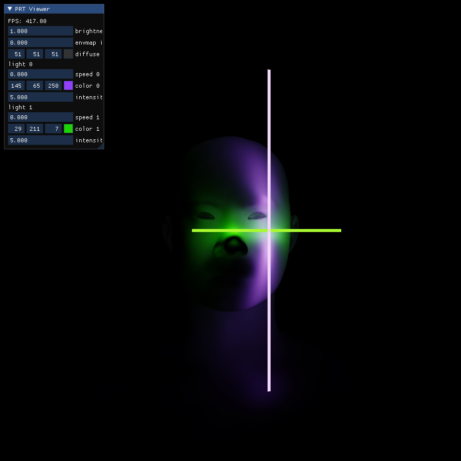

# Analytic SH Area Light

Implementation of paper: [Analytic Spherical Harmonic Coefficients for Polygonal Area Lights](https://cseweb.ucsd.edu/~viscomp/projects/ash/)



## Usage

### run demo

run real-time demo with provided datas:

```bash
run.bat
```

### run full pipeline (precompute + real-time)

place your data under `data/` folder as:

- mesh: `data/your_mesh.obj`
- envmap: `data/your_envmap.exr`

and modify the variables in `run_full.bat`:

```bat
set envmap=your_envmap
set mesh=your_mesh
```

and run:

```bash
run_full.bat
```

## TODO

- Use `trimesh` for mesh io replacing `open3d`
- Use `pytorch-minimize` to optimize zonal harmonics

## Reference

1. "An efficient representation for irradiance environment maps" by Ravi Ramamoorthi, Pat Hanrahan, SIGGRAPH 2001
2. "Sparse Zonal Harmonic Factorization for Efficient SH Rotation" by Derek Nowrouzezahrai et al., SIGGRAPH 2012
3. "spherical-harmonics" https://github.com/google/spherical-harmonics
4. "SphericalHarmonics" https://github.com/chalmersgit/SphericalHarmonics
5. "Analytic Spherical Harmonic Coefficients for Polygonal Area Lights" by Jingwen Wang, Ravi Ramamoorthi, SIGGRAPH 2018
6. "Applications of Irradiance Tensors to the Simulation of Non-Lambertian Phenomena" by James Arvo, SIGGRAPH 1995